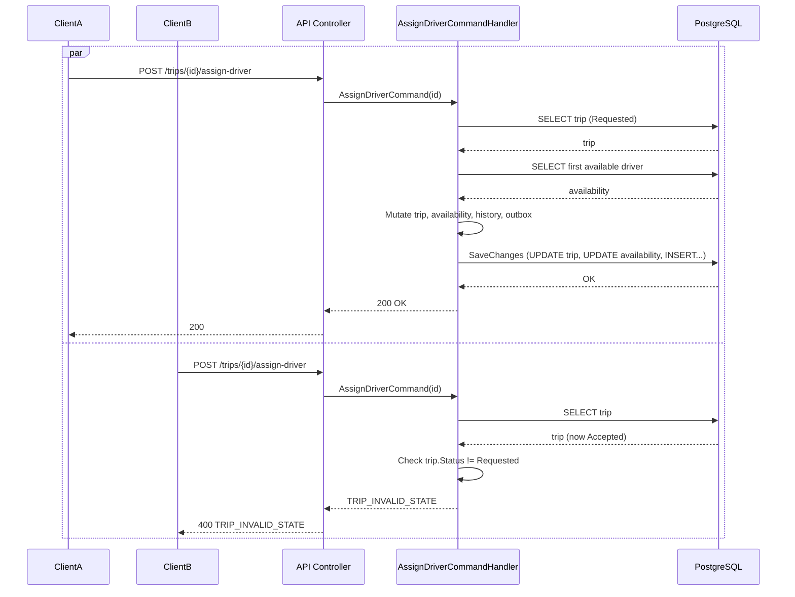
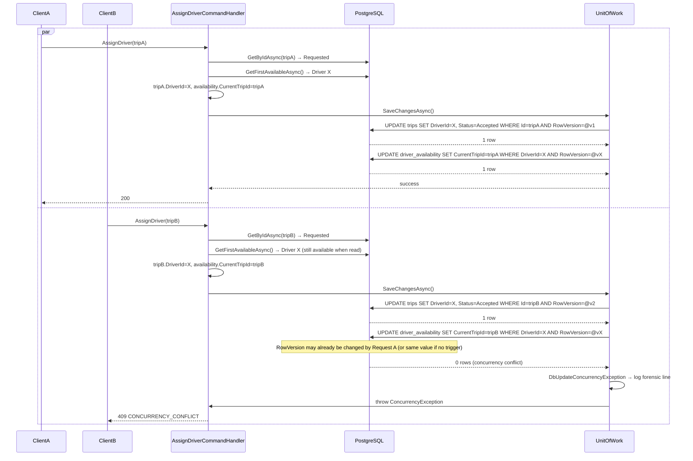

# Assign-Driver Concurrency Flow — Developer Documentation

**Endpoint:** `POST /api/v1/trips/{id}/assign-driver`  
**Purpose:** Explain how concurrency is handled and how to interpret results for backend engineers.

---

## 1. Architecture Overview

Assign-driver selects an available driver for a trip (in `Requested` state), updates the trip and driver availability in a single transaction, and publishes an outbox event. Concurrency is handled via **optimistic locking** (RowVersion) and **state validation** (trip must be Requested).

### How assign-driver works internally

1. **Controller** (`TripsController.AssignDriver`) receives the trip `id`, sends `AssignDriverCommand(id)` via MediatR.
2. **AssignDriverCommandHandler**:
   - Authorizes (Admin/Support only).
   - Loads **Trip** by id; fails if not found or not in state `Requested`.
   - Loads first available **DriverAvailability** (IsOnline, CurrentTripId null, tenant-scoped).
   - Mutates Trip (DriverId, Status=Accepted, UpdatedAtUtc/By).
   - Adds **TripStatusHistory** (Requested → Accepted).
   - Mutates **DriverAvailability** (CurrentTripId = trip.Id, UpdatedAtUtc).
   - Adds **OutboxMessage** (DriverAssigned).
   - Calls **UnitOfWork.SaveChangesAsync()** — single transaction.
3. **Repositories** (TripRepository, DriverAvailabilityRepository) use **EF Core** against **PostgreSQL**; Trip and DriverAvailability both have a **RowVersion** (bytea) concurrency token.
4. **UnitOfWork** wraps `DbContext.SaveChangesAsync()`. On **DbUpdateConcurrencyException** it logs forensic data (EntityName, PrimaryKey, State, ConcurrencyToken original/current) and rethrows **ConcurrencyException**; the handler maps that to **409 CONCURRENCY_CONFLICT**.

### Components involved

| Component | Role |
|-----------|------|
| **Controller** | HTTP entry; maps handler result to 200/4xx (e.g. CONCURRENCY_CONFLICT → 409). |
| **AssignDriverCommandHandler** | Orchestrates load → validate → mutate → SaveChanges; catches ConcurrencyException → CONCURRENCY_CONFLICT. |
| **Repositories** | TripRepository (GetByIdAsync), DriverAvailabilityRepository (GetFirstAvailableAsync); no explicit locking. |
| **UnitOfWork** | Single SaveChangesAsync; catches DbUpdateConcurrencyException, logs forensically, throws ConcurrencyException. |
| **DriverAvailability** | Entity with DriverId (PK), IsOnline, CurrentTripId, UpdatedAtUtc, **RowVersion** (concurrency token). |
| **Trip** | Entity with Id (PK), Status, DriverId, **RowVersion** (concurrency token). |
| **EF Core** | Generates UPDATE with `WHERE Id = @p AND RowVersion = @original` (or equivalent); 0 rows affected → DbUpdateConcurrencyException. |
| **PostgreSQL** | Persists trips and driver_availability; RowVersion stored as bytea. |

---

## 2. Sequence Diagram — Scenario A (Same Trip, Two Concurrent Calls)

Two clients call assign-driver for the **same** trip. The first request transitions the trip to Accepted; the second sees the trip no longer in Requested and fails **before** any database write.



### Why the second request returns 400 TRIP_INVALID_STATE

- **Request 1** loads the trip while it is still `Requested`, updates it to `Accepted`, and commits.  
- **Request 2** loads the same trip **after** Request 1 has committed (or in a race, may still see Requested once). If it sees `Status != Requested`, the handler returns immediately with **"Trip is not in Requested state"** and code **TRIP_INVALID_STATE** — no SaveChanges, so no RowVersion conflict.  
- So in Scenario A the main protection is **state validation** in the handler, not the concurrency token. The expected outcome is **200** for one request and **400 TRIP_INVALID_STATE** for the other.

---

## 3. Sequence Diagram — Scenario B (Two Trips, Same Driver)

Two clients call assign-driver for **two different** trips. Both requests select the **same** driver (first available). The first SaveChanges updates that driver’s availability; the second tries to update the same DriverAvailability row with the same (or stale) RowVersion and gets **0 rows affected** → DbUpdateConcurrencyException → 409 CONCURRENCY_CONFLICT.



### Why the second request returns 409 CONCURRENCY_CONFLICT

- Both handlers read the **same** DriverAvailability row (Driver X) because both see it as available (CurrentTripId null) at read time.
- **Request 1** commits first: it updates Trip A and updates DriverAvailability (CurrentTripId = tripA, and optionally RowVersion if the DB updates it).
- **Request 2** then runs UPDATE on **driver_availability** with `WHERE DriverId = X AND RowVersion = @vX`. If the row was already updated by Request 1, the stored RowVersion may differ from `@vX`, so the UPDATE affects **0 rows**. EF Core throws **DbUpdateConcurrencyException**.
- **UnitOfWork** catches it, logs the conflict (Entity=DriverAvailability, PrimaryKey=DriverId, ConcurrencyToken original/current), and throws **ConcurrencyException**. The handler returns failure with code **CONCURRENCY_CONFLICT**; the controller maps that to **409 Conflict**.

---

## 4. Concurrency Token Flow (RowVersion in EF Core)

Trip and DriverAvailability each have a **RowVersion** property (bytea in PostgreSQL) marked as **concurrency token** (`IsConcurrencyToken()`). EF uses it to implement optimistic concurrency.

### Original and current token

- **Original value:** The value read from the database when the entity was loaded (e.g. by GetByIdAsync or GetFirstAvailableAsync).
- **Current value:** The value in memory when SaveChanges is called. For RowVersion we do not change it in application code, so “current” is usually the same as “original” unless the entity was reloaded or refreshed.

### Update check

For each modified entity, EF Core generates an UPDATE that includes the concurrency token in the WHERE clause:

```sql
UPDATE driver_availability
SET "CurrentTripId" = @p0, "UpdatedAtUtc" = @p1
WHERE "DriverId" = @p2 AND "RowVersion" = @p3
```

- If **one row** is updated, SaveChanges succeeds.  
- If **zero rows** are updated (another transaction already changed the row so RowVersion no longer matches), EF throws **DbUpdateConcurrencyException**.

So the concurrency token flow is: **read (original)** → **modify other columns** → **SaveChanges (WHERE RowVersion = original)** → **0 rows** → exception.

---

## 5. Forensic Logging

When **UnitOfWork** catches `DbUpdateConcurrencyException`, it iterates over `ex.Entries` and logs one **Warning** per failed entity before rethrowing **ConcurrencyException**.

### What is logged

- **EntityName** — e.g. `Trip` or `DriverAvailability`.
- **PrimaryKey** — e.g. `Id=guid` or `DriverId=guid`.
- **State** — e.g. `Modified`.
- **ConcurrencyToken** — For each concurrency token property: **Original** and **Current** (byte[] as HEX, e.g. `0xABCD...`).

Helpers used: `GetPrimaryKeyValue(entry)` and `GetConcurrencyTokenValues(entry)` (Original/Current per token).

### Example log line

```text
Concurrency conflict. Entity=DriverAvailability PrimaryKey=DriverId=xxxxxxxx-xxxx-xxxx-xxxx-xxxxxxxxxxxx State=Modified ConcurrencyToken=RowVersion: Original=0x1A2B3C4D5E6F7080 Current=0x1A2B3C4D5E6F7080
```

Capture this full line from the **API process console** (stdout) when a 409 CONCURRENCY_CONFLICT occurs; it identifies which entity conflicted and the token values for debugging.

---

## 6. Stability Interpretation

| HTTP | Code | Meaning |
|------|------|--------|
| **200** | — | Assign-driver succeeded; trip is Accepted and the driver’s availability has been updated. |
| **400** | TRIP_INVALID_STATE | Trip is not in state Requested (e.g. already Accepted). **Expected in Scenario A** when the second request runs after the first has committed. |
| **409** | CONCURRENCY_CONFLICT | SaveChanges threw DbUpdateConcurrencyException (e.g. same driver reserved by another request). **Expected in Scenario B** for the losing request. Client should retry (possibly with backoff). |
| **409** | NO_DRIVERS_AVAILABLE | No driver availability row with IsOnline and CurrentTripId null (for the tenant). No concurrency; simply no driver to assign. |

Summary:

- **200** → success.  
- **400 TRIP_INVALID_STATE** → expected when two requests target the **same** trip; one wins, the other is rejected by state check.  
- **409 CONCURRENCY_CONFLICT** → expected when two requests target **different** trips but compete for the **same** driver; one wins, the other fails on RowVersion.

---

## 7. Developer Guidance (Troubleshooting)

### If the forensic log shows Entity=Trip

- The conflict was on the **trip** row (UPDATE trips WHERE Id = ... AND RowVersion = ... affected 0 rows).
- **Investigate:** Trip update ordering and whether multiple handlers can update the same trip in the same window (e.g. assign-driver and another command). Check that only one code path updates the trip to Accepted for that id.
- **Typical cause:** Two flows updating the same trip concurrently; ensure transition to Accepted is single-writer (e.g. only assign-driver or accept) and state checks run before SaveChanges.

### If the forensic log shows Entity=DriverAvailability

- The conflict was on the **driver availability** row (UPDATE driver_availability WHERE DriverId = ... AND RowVersion = ... affected 0 rows).
- **Investigate:** **Driver reservation logic** — two assign-driver requests (for two trips) both selected the same driver and both tried to set CurrentTripId. This is **expected in Scenario B**; the second request should return 409 CONCURRENCY_CONFLICT.
- **Typical cause:** No pessimistic lock or atomic “reserve driver” (e.g. UPDATE ... WHERE CurrentTripId IS NULL RETURNING); both requests read the same available driver. Consider documenting retry behavior or, in a future change, atomic reservation (without changing EF model/migrations per current constraints).

### General

- Use the **exact** forensic line (Entity, PrimaryKey, State, ConcurrencyToken) to confirm which entity and which token value caused the conflict.
- Ensure **CONCURRENCY_CONFLICT** is never returned when the only issue is “no driver available”; that case must remain **NO_DRIVERS_AVAILABLE** (handler: availability == null → NO_DRIVERS_AVAILABLE; catch ConcurrencyException → CONCURRENCY_CONFLICT).
